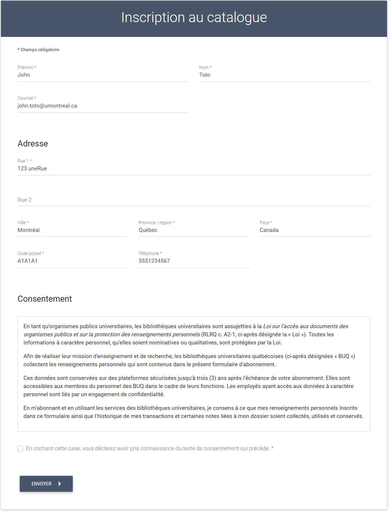

# Formulaire de création d'usagers

## Introduction

Cette application Node.js contient les composants serveur et client pour permettre la création d'usagers dans WorldShare Management Services (WMS) via un formulaire Web. Un courriel de confirmation est également envoyé à l'usager ainsi qu'à une adresse institutionnelle. Une copie de chaque demande est conservée dans le dossier `data`.

Le formulaire html d'inscription d'usager peut être pré-rempli en ajoutant les paramètres GET à l'URL. Par exemple:

`http://localhost:3000/formulaire/?givenName=John&familyName=Toto&email=john.toto@umontreal.ca&streetAddress=allo%0Atoto&locality=Montr%C3%A9al&region=Qu%C3%A9bec&country=Canada&postalCode=A1A1A1&telephone=5551234567`

Les données du formulaire sont envoyées à l'`API Usagers` qui se chargera de transmettre le tout à l'API de WorldShare. Les données suivantes seront ajoutée par l'API Usagers avant d'être transmises:

- Un code barres. Celui-ci est composé selon le pattern `um00000n` où `n` est un numéro séquentiel;
- Une date de péremption `oclcExpirationDate` définit au 1er octobre à venir;
- La propriété `isVerified` définie à `false`.

## Préalables

- Node.js, version 10 ou plus récente;
- L'utilitaire CURL doit être présent dans l'environnement d'exécution et accessible par l'usager exécutant l'application Node.js;
- Vous devez vous procurer une clé WMS pour l'accès en lecture/écriture au service User Data SCIM API (SCIM). Cette clé doit être obtenue auprès d'OCLC. Selon la [documentation disponible](https://www.oclc.org/developer/develop/web-services/worldshare-identity-management-api.en.html), vous devez écrire directement à devnet@oclc.org afin de vous en procurer une;
- Accès à un serveur smtp pour l'envoi de courriels.

## Installation

Téléchargez les sources directement à partir du dépôt Github [remillc-udem/usagers](https://github.com/remillc-udem/usagers), puis installez l'application Node:

`> npm install`

## Configuration

### Serveur

L'application utilise le module [config](https://www.npmjs.com/package/config) pour gérer les configurations serveur. Dupliquez le fichier `default.js.template` et renommez-le:

`> cp config/default.js.template config/default.js`

Éditez le fichier afin d'y ajouter les informations concernant :

- `identityManagementAPIWsKey`: votre clé WMS pour l'accès au service SCIM (key, secret et institution);
- `mailer.smtp`: les coordonnées du serveur smtp;
- `mailer.from`: l'adresse courriel de l'expéditeur du courriel.

Éditez le fichier `template/email.html` afin d'y inclure l'identité de votre institution.

### Formulaire

Assurez-vous de modifier l'attribut `action` du formulaire html si vous choisissez de l'héberger ailleurs qu'à son emplacement d'origine.

Vous pouvez personnaliser les couleurs du formulaire en modifiant le fichier `src/scss/_custom-variables.scss`. Vous devrez exécuter la tâche `npm run dev` afin de recompiler la feuille de style CSS.

Adaptez le message d'accusé réception qui se trouve dans la section `#section-confirmation`.

## Exécution

Divers script npm sont disponibles, dont:

- `npm run dev` - Démarre le serveur d'API Usagers, incluant un serveur statique pour le formulaire HTML, ainsi qu'un service sass pour recompiler la feuille de style css à la volée;
- `npm run serve` - Démarre le serveur d'API Usagers, incluant le serveur statique pour le formulaire HTML. Script conçu pour la production;

Ouvrez l'adresse http://localhost:3000/formulaire/